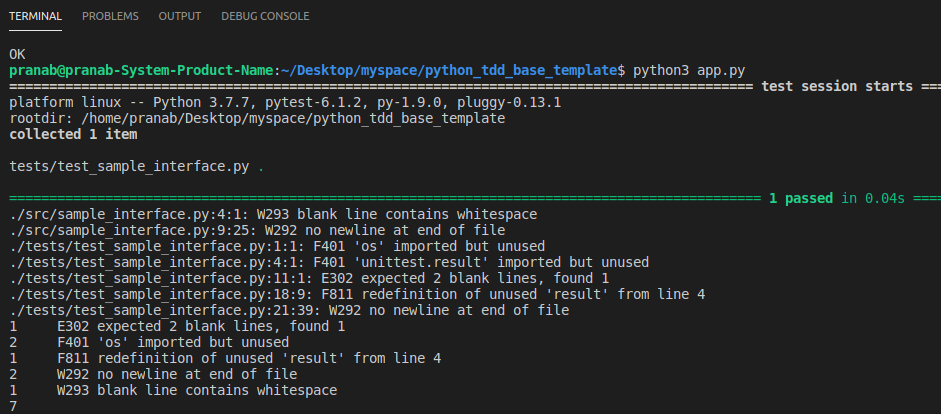

# sam_python_tdd_base_template

## Overview

This is a simple AWS SAM Python Base Template, where we can leverage the benfits of test driven development and follow the `PEP-8` standard.

## Steps - Involved

1. We have to write their code in the `src` directory with their testcases inside the `tests` directory.

2. The request/responce for the respective python module should be maintained inside the `tests/fixtures` directory in `.json` format.

3. We can check their code by executing `python test.py` inside their terminal/command prompt.



If there is any error/warning in their code, we can watch the details inside the terminal/command prompt as shown in the picture above and fix accordingly

4. Use the SAM CLI to build your docker image.

Build your application with this command-

```bash
sam-app$ sam build
```

5. Use the SAM CLI to test locally

This command will start the application locally-

```bash
sam local start-api
```

6. To invoke the application we can use terminal/postman.

This command invoke the application locally-

```bash
curl http://127.0.0.1:3000/
```

## Setup Guide

First of all, you need to install docker and SAM CLI. Once you are done then clone this repo using terminal/command prompt after running-

`git clone https://github.com/pranabsarkar/sam_python_tdd_base_template.git`

Once, it is cloned move into the directory and open terminal/command prompt in the current directory and run this command to insatall the dependencies-

`pip install -r requirements-local.txt`

Open terminal/command prompt and run this command to execute the test suite-

`python test.py `


## Reference

1. [PyTest](https://docs.pytest.org/en/latest/)
2. [flake8](https://flake8.pycqa.org/en/latest/)
3. [Test Driven Development](https://en.wikipedia.org/wiki/Test-driven_development) 
4. [AWS SAM developer guide](https://docs.aws.amazon.com/serverless-application-model/latest/developerguide/what-is-sam.html) for an introduction to SAM specification, the SAM CLI, and serverless application concepts.

## Author Note

Please feel free to add your input's :)
